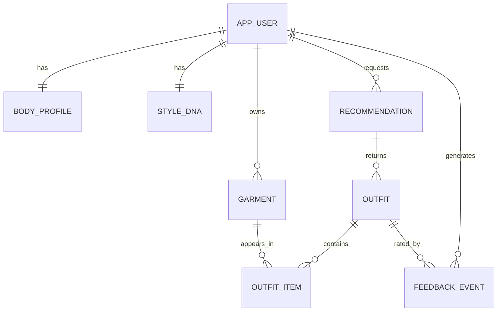

# StyleOS — Data Model & Schema

The whole system hangs off these entities. Decide this before writing app code. Colors are stored **numerically** (HSL or LAB), never as words — the color-harmony logic depends on it. `recommendation` and `feedback_event` are designed in from day one because together they power the evaluation.

## Entities overview



## Tables

### app_user
The table is `app_user`, not `user` — `user` is a reserved keyword in Postgres and `create table user` is a syntax error. Renamed rather than permanently double-quoted. See `supabase/migrations/0001_init.sql`.

| field | type | notes |
|---|---|---|
| id | uuid PK/FK | `references auth.users(id)` — the Supabase auth id |
| email | text | |
| created_at | timestamptz | |

### body_profile
| field | type | notes |
|---|---|---|
| user_id | uuid PK/FK | one per user |
| height_cm | int null | optional |
| body_type | text null | self-reported (e.g. pear, rectangle) |
| preferred_fit | text null | e.g. relaxed, fitted, oversized |
| notes | text null | free preferences ("I like oversized") |

Body data is an **aid, not a rule** — it's a scoring input, never a hard filter.

### garment
| field | type | notes |
|---|---|---|
| id | uuid PK | |
| user_id | uuid FK | |
| image_url | text | Supabase storage (background removed) |
| category | text | top / bottom / outerwear / shoes / accessory |
| subcategory | text null | e.g. blazer, chinos |
| color_primary | jsonb | `{h,s,l}` or LAB triple |
| color_secondary | jsonb null | |
| material | text null | |
| fit | text null | |
| pattern | text null | solid / striped / … |
| formality | int | 1–5 |
| seasons | text[] | [spring, summer, …] |
| style_tags | text[] | [minimal, streetwear, …] |
| occasion_tags | text[] | [work, date, formal, …] |
| tag_source | text | `ai` \| `user_corrected` |
| embedding | vector null | optional, pgvector (future "similar item") |
| created_at | timestamptz | |

### recommendation
One row per `POST /recommend` call. **This is the "shown" record** — without it, `acceptance_rate = accepted / shown` has no denominator.

| field | type | notes |
|---|---|---|
| id | uuid PK | |
| user_id | uuid FK | |
| occasion | text | the request's resolved occasion |
| context | jsonb | weather, temperature, etc. at request time |
| seq_no | int | nth recommendation for this user — see below |
| latency_ms | int | engine response time, for the latency metric |
| created_at | timestamptz | |

Constraints: `unique (user_id, seq_no)`, index on `(user_id, created_at)`.

`seq_no` is assigned server-side on insert (`max(seq_no) + 1` for that user, inside the transaction). It exists so the early-vs-later comparison is a `WHERE seq_no <= N` clause rather than a window function over timestamps — cheaper to write, cheaper to read, and stable if you ever backfill.

### outfit
| field | type | notes |
|---|---|---|
| id | uuid PK | returned to the client so feedback can reference it |
| recommendation_id | uuid FK | |
| rank | int | 1–3 within the recommendation |
| score | float | engine's total score |
| confidence | int | 0–100 (surfaced to user) |
| weakest_factor | text null | the factor that capped confidence, for "why only 61%?" |
| reasons | jsonb | per-item explanation strings from the stylist |

Constraint: `unique (recommendation_id, rank)`.

`occasion` and `context` are **not** duplicated here — they belong to the parent recommendation. No `user_id` either; it's reachable via the join, and duplicating it invites the two copies to disagree.

### outfit_item
| field | type | notes |
|---|---|---|
| outfit_id | uuid FK | |
| garment_id | uuid FK | |
| role | text | top / bottom / shoes / … |

### style_dna
| field | type | notes |
|---|---|---|
| user_id | uuid PK/FK | one per user |
| weights | jsonb | per-attribute preference weights (colors, styles, fits, formality) |
| descriptors | text[] | human-readable summary (["minimal","monochrome"]) shown in UI |
| updated_at | timestamptz | |

### feedback_event
| field | type | notes |
|---|---|---|
| id | uuid PK | |
| user_id | uuid FK | denormalized on purpose — every metrics query filters by user |
| outfit_id | uuid FK | |
| signal | text | `accepted` \| `liked` \| `disliked` |
| created_at | timestamptz | **the evaluation backbone — timestamped for before/after analysis** |

Constraint: `unique (outfit_id, signal)` — a user can both like and accept the same outfit, but not accept it twice.

**There is no `ignored` signal.** An ignored recommendation is one with no feedback events; it's derived at query time. Writing an `ignored` row would require a timer or cron job to decide when "no response yet" becomes "ignored" — infrastructure v1 doesn't need and shouldn't carry.

## Metric definitions

Acceptance is measured **per recommendation**, not per outfit, because the user is shown three options and picking any one is a success:

```sql
-- acceptance rate for a user's first N recommendations
select count(*) filter (where accepted)::float / nullif(count(*), 0)
from (
  select r.id,
         exists (
           select 1 from outfit o
           join feedback_event f on f.outfit_id = o.id
           where o.recommendation_id = r.id and f.signal = 'accepted'
         ) as accepted
  from recommendation r
  where r.user_id = $1 and r.seq_no <= $2
) t;
```

Swap `<=` for `>` to get the later window. `improvement = later - early`.

## Design notes
- **Color numeric, always.** Store HSL/LAB so harmony scoring is math, not string matching.
- **`recommendation` is the unit of measurement.** It records what was shown, when, how long it took, and where it sits in the user's history. Everything in the evaluation plan is a query over this table joined to `feedback_event`.
- **`tag_source`** lets you measure CV correction rate (a quality signal) and lets the correction UI overwrite AI tags cleanly.
- **`feedback_event` is append-only.** Never mutate; the timeline is what lets you show "acceptance rate improved after N interactions."
- **The engine writes with the Supabase service-role key**, which bypasses RLS. Every engine query must therefore filter by the JWT-derived `user_id` explicitly, through the single `repository` module. RLS policies still apply to everything the web app reads directly.
- **`embedding` is optional/future** — include the nullable column now so adding pgvector-based "similar item" later needs no migration pain.
- **Deletes cascade along user ownership only.** Removing a user removes their body profile, Style DNA, wardrobe, recommendations, outfits and feedback. The single exception is `outfit_item.garment_id`, which is `on delete restrict`: a garment that appears in a past outfit cannot be deleted, so recommendation history stays intact for the evaluation queries. This is what makes `DELETE /api/garments/:id` a fallible call — see the architecture doc.
